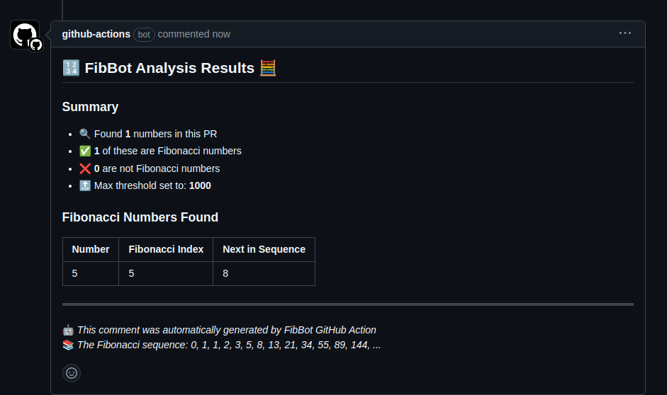

# FibBot GitHub Action


The **FibBot** is a GitHub Action designed to calculate the Fibonacci sequence for numbers mentioned in a pull request's description. It extracts numbers from the PR description, computes the Fibonacci sequence, and posts a comment with the results. This action can be configured to handle various input parameters, such as enabling the Fibonacci calculation and setting a maximum threshold for the numbers.

## Features
- Automatically calculates Fibonacci sequences based on numbers found in pull request descriptions.
- Supports configuration options to control Fibonacci calculation behavior (e.g., enabling/disabling the action, setting maximum thresholds).
- Provides results directly within the pull request as a comment.
- Designed to work with minimal setup and can be integrated into any repository using GitHub Actions.

## Setup & Usage

### 1. **Add FibBot Action to Your Project**

To use the FibBot GitHub Action in your project, you need to add the action to your workflow configuration. Follow these steps:

1. **Create a `.github/workflows/test.yml` file** in your repository.

2. **Configure the action** within the workflow:

```yaml
name: Use FibBot Custom Action
on: [pull_request]

jobs:
  run-fibbot:
    runs-on: ubuntu-latest
    steps:
      - name: Checkout Repository
        uses: actions/checkout@v4

      - name: Run FibBot Action
        uses: bansikah22/fibbot@master
        with:
          enable_fib: true # false to disable
          max_threshold: 1000
          github_token: ${{ secrets.GITHUB_TOKEN }}
```
## Parameter Configuration

The action accepts the following inputs:

- **`enable_fib`** (boolean): Set to `true` to enable Fibonacci calculation, or `false` to disable it.
- **`max_threshold`** (integer): The maximum threshold value for the Fibonacci numbers to calculate. The action will not compute Fibonacci for numbers greater than this threshold.

## Creating a Pull Request

Once the action is set up, the Fibonacci calculation will be triggered every time a pull request is opened, synchronized, or reopened. 

The action will parse the PR description, extract numbers, compute Fibonacci sequences for them, and post the results as comments in the PR.

## Example PR description


you can also visit this repository to this [Test Fibbot](https://github.com/bansikah22/test-fibbot)

## License

This project is licensed under the MIT License.

## Open Source

This repository is open-source and licensed under the MIT License. Contributions are welcome! Please feel free to open issues or submit pull requests to improve this project.
